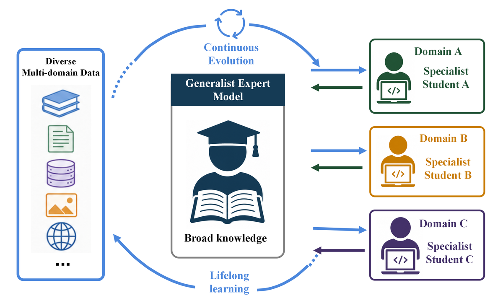
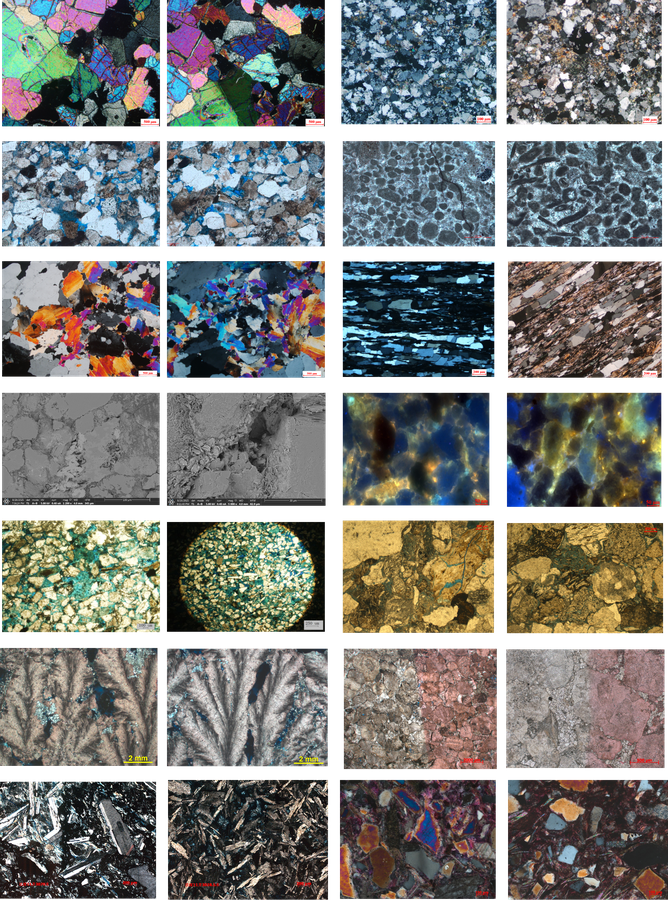
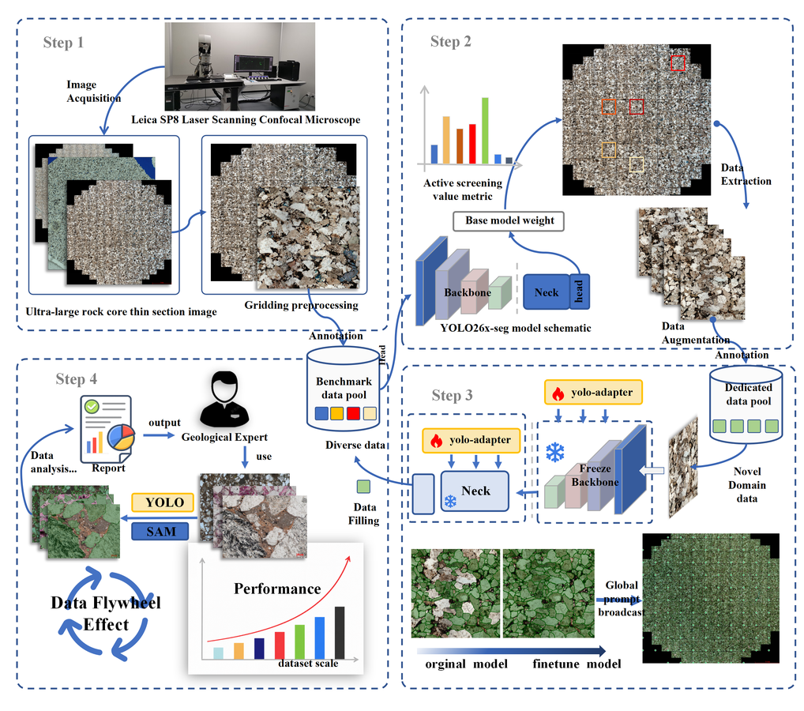
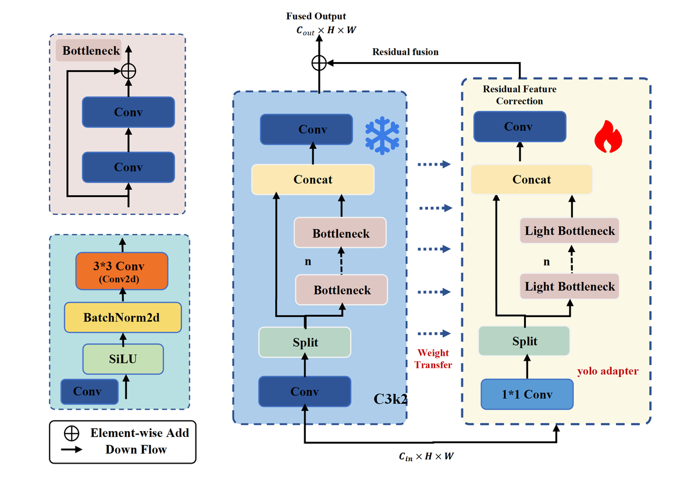
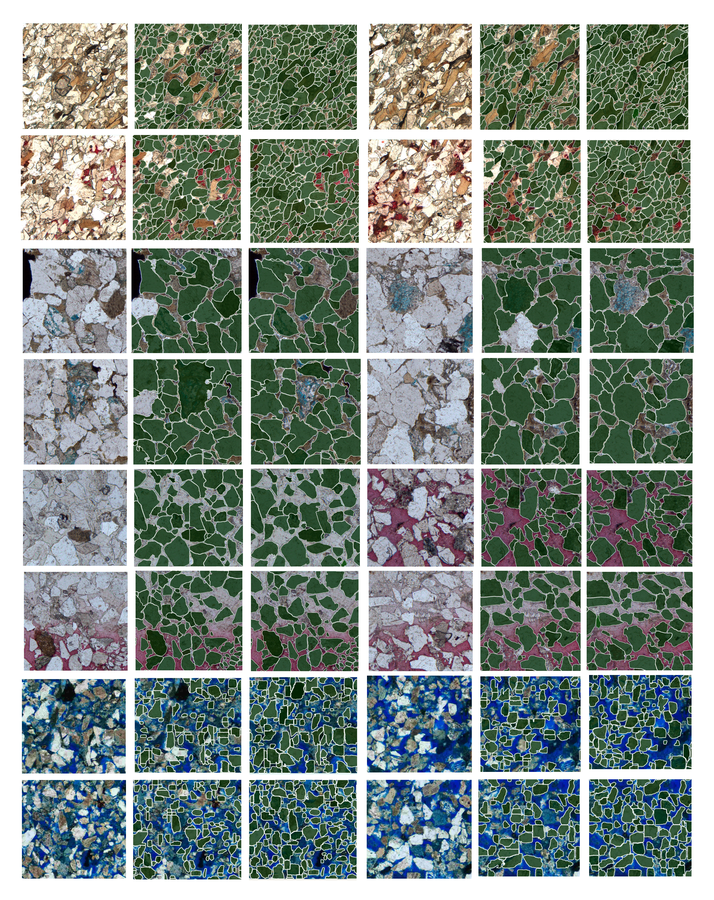
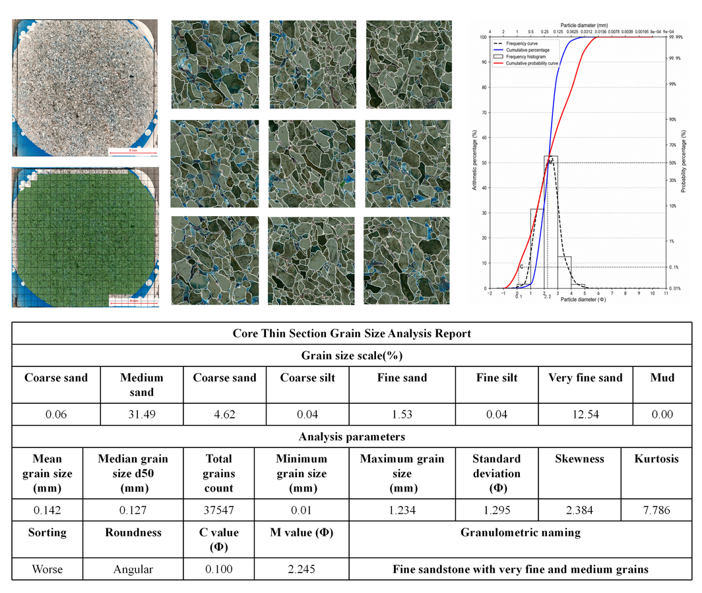

# yolo-adapter: Continual Domain Adaptation for Petrographic Thin-Section Segmentation

This repository introduces a continual domain adaptation framework for mineral-grain instance segmentation in petrographic thin-section images.

The work focuses on data-scarce industrial image-analysis scenarios where new image domains continuously appear because of changes in imaging equipment, polarization conditions, sample preparation, lithology, mineral assemblage, and image quality. Instead of retraining a full segmentation model for every new domain, the proposed framework uses a lightweight **yolo-adapter** strategy to rapidly adapt a student model with only a small number of annotated samples.

## Overview

The proposed framework combines active learning, parameter-efficient domain adaptation, and continual learning. A general expert model accumulates knowledge from multi-source thin-section data, while a domain-specific student model adapts quickly to new thin-section domains. Corrected or quality-screened results are then returned to the expert-model data pool, forming a closed learning loop.



## Motivation

Petrographic thin-section interpretation is important for reservoir evaluation, mineral-grain analysis, pore analysis, and automated geological reporting. However, thin-section images from different regions and imaging settings often show strong domain shifts. A model trained on one domain may perform poorly on new-domain images, especially when only a few labeled samples are available.



## Method

The framework follows four main stages:

1. **Grid-based image tiling**  
   Ultra-large petrographic thin-section images are divided into smaller image tiles for annotation, training, and inference.

2. **Active sample selection**  
   High-value image regions are selected for expert annotation, reducing the cost of manual labeling.

3. **yolo-adapter-based domain adaptation**  
   A lightweight adapter module is inserted into the segmentation model. Most original parameters are preserved, while the adapter learns new-domain characteristics such as color, texture, grain boundary, and mineral morphology.

4. **Continual knowledge accumulation**  
   High-quality adapted results are returned to the expert-model data pool, allowing the model system to improve continuously over time.



## yolo-adapter Module

The yolo-adapter is designed for efficient adaptation in YOLO-based instance segmentation. It aims to improve new-domain performance while reducing the risks of overfitting and catastrophic forgetting under few-sample training conditions.



## Experimental Results

Experiments on multiple new-domain petrographic thin-section datasets show that yolo-adapter can improve segmentation quality after short adaptation. The adapted model shows better mineral-grain boundary recognition, adjacent-grain separation, and missed-region correction than the unadapted baseline model.



The segmentation output can also support downstream quantitative analysis, including grain-size statistics, area-proportion calculation, and automated report generation.



## Repository Structure

```text
.
+-- README.md
+-- images/
|   +-- *.png                  # Figures used in the GitHub README
```

## Keywords

Petrographic thin section; mineral-grain instance segmentation; yolo-adapter; active learning; continual learning; domain adaptation; parameter-efficient adaptation.

## Notes

The repository is intended to provide a concise project overview and visual materials. Manuscript files are not required for this GitHub page.
